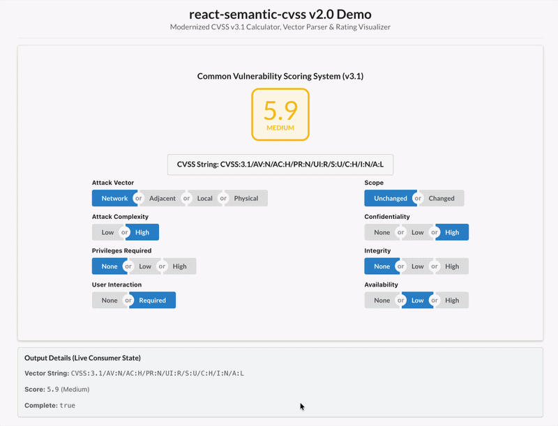

# react-semantic-cvss

> Interactive CVSS v3.1 base score calculator, vector parser, and severity rating visualizer for React, built on Semantic UI.

[](https://www.npmjs.com/package/react-semantic-cvss)
[](https://www.npmjs.com/package/react-semantic-cvss)
[](https://www.npmjs.com/package/react-semantic-cvss)
[](https://opensource.org/licenses/MIT)
[](https://github.com/RidRupasinghe/react-semantic-cvss/actions/workflows/ci.yml)



## Features

- **CVSS v3.1 compliant**: implements the FIRST CVSS v3.1 base score equations, including the official `Roundup` function.
- **React 16.8 – 18**: works with any hooks-capable React version up to 18. Ships with a `"use client"` directive for the Next.js App Router.
- **TypeScript types included**: no separate `@types` package needed.
- **ESM and CommonJS builds** with a proper `exports` map.
- **Headless utilities**: use the scoring, parsing and rating functions without rendering any UI (e.g. on a server or in a CLI).
- **Accessible**: metric groups use radio-group semantics, are keyboard navigable, and the score is announced to screen readers.
- **Mobile friendly**: button groups adapt to narrow screens.

## Installation

```bash
npm install react-semantic-cvss semantic-ui-react semantic-ui-css styled-components
```

`react-semantic-cvss` relies on the following peer dependencies, which your app must provide:

| Package | Supported versions |
| :--- | :--- |
| `react`, `react-dom` | `^16.8.0`, `^17.0.0` or `^18.0.0` |
| `semantic-ui-react` | `^0.88.2`, `^1.0.0` or `^2.0.0` |
| `styled-components` | `^5.0.0` or `^6.0.0` |

Then import the Semantic UI stylesheet once, in your app's entry point (e.g. `main.tsx`, `index.js` or `_app.tsx`):

```js
import 'semantic-ui-css/semantic.min.css';
```

> **React 19 is not supported yet.** `semantic-ui-react` is no longer maintained and relies on `findDOMNode`, which React 19 removed, so the component crashes on React 19.

> The component does not include this stylesheet itself, so it won't be added twice if your app already uses Semantic UI.

### Using Vite 8 or newer

Vite 8's CSS minifier (Lightning CSS) rejects an invalid selector inside `semantic-ui-css`, which makes `vite build` fail. Tell it to skip that rule in `vite.config.ts`:

```ts
export default defineConfig({
  // ...
  css: {
    lightningcss: { errorRecovery: true }
  }
});
```

## Quick start

```tsx
import { useState } from 'react';
import CVSSCalc, { CVSSCalculationResult } from 'react-semantic-cvss';

export default function App() {
  const [vector, setVector] = useState('CVSS:3.1/AV:N/AC:L/PR:N/UI:N/S:C/C:H/I:H/A:H');

  const handleChange = (result: CVSSCalculationResult) => {
    setVector(result.string);

    if (result.isComplete) {
      console.log(result.score);              // 10
      console.log(result.scoreString);        // "10.0"
      console.log(result.ratingDetails.name); // "Critical"
    }
  };

  return <CVSSCalc vector={vector} onChange={handleChange} />;
}
```

### Read-only display

To show an existing score without letting the user change it:

```tsx
<CVSSCalc
  vector="CVSS:3.1/AV:N/AC:H/PR:N/UI:R/S:U/C:H/I:N/A:L"
  readOnly
  showHintsOnButton={false}
  showHintsOnButtonGroupName={false}
/>
```

## Component props

| Prop | Type | Default | Description |
| :--- | :--- | :--- | :--- |
| `vector` | `string` | `""` | CVSS vector to display, e.g. `"CVSS:3.1/AV:N/AC:L/..."`. The component updates when this changes. An invalid vector shows an error message. |
| `onChange` | `(result: CVSSCalculationResult) => void` | – | Called every time the user selects a metric value. |
| `title` | `string` | `"Common Vulnerability Scoring System"` | Heading shown above the score. Pass `""` to hide it. |
| `readOnly` | `boolean` | `false` | Displays the selections without allowing changes. |
| `showHintsOnButton` | `boolean` | `true` | Shows an explanation popup when hovering over or focusing a metric value button. |
| `showHintsOnButtonGroupName` | `boolean` | `true` | Shows an explanation popup when clicking a metric name (e.g. "Attack Vector"). |
| `className` | `string` | – | Extra CSS class for the outer wrapper. |

### `onChange` behaviour

- `onChange` fires only in response to user clicks, never when the `vector` prop changes. You can safely store `result.string` in state and pass it back as `vector`.
- It also fires while the selection is still incomplete. Check `result.isComplete` before using the score.

### `CVSSCalculationResult`

```ts
interface CVSSCalculationResult {
  score: number | null;               // e.g. 8.1, or null until all 8 metrics are selected
  scoreString: string;                // e.g. "8.1", or "-" when incomplete
  string: string;                     // full vector, e.g. "CVSS:3.1/AV:N/...", or "" when incomplete
  selections: Record<string, string>; // e.g. { AV: "N", AC: "L", ... }
  ratingDetails: {
    name: 'None' | 'Low' | 'Medium' | 'High' | 'Critical' | '?'; // '?' when incomplete
    bottom: number | string;          // lower bound of the rating range
    top: number | string;             // upper bound of the rating range
    color: string;                    // hex colour for the rating
  };
  isComplete: boolean;                // true when all 8 base metrics are selected
}
```

## Headless utilities

The calculation engine is exported separately and has no React or DOM dependency:

```ts
import { calculateCVSS31, parseCVSS31Vector, getSeverityRating } from 'react-semantic-cvss';

// Calculate a score from metric selections
const result = calculateCVSS31({
  AV: 'N', AC: 'L', PR: 'N', UI: 'N',
  S: 'C', C: 'H', I: 'H', A: 'H'
});
result.score;              // 10
result.ratingDetails.name; // "Critical"
result.string;             // "CVSS:3.1/AV:N/AC:L/PR:N/UI:N/S:C/C:H/I:H/A:H"

// Parse and validate a vector string
const parsed = parseCVSS31Vector('CVSS:3.1/AV:N/AC:H/PR:N/UI:R/S:U/C:H/I:N/A:L');
if (parsed.ok) {
  parsed.selections; // { AV: "N", AC: "H", PR: "N", ... }
} else {
  parsed.error;      // e.g. { title: "Invalid Option Value", message: "Invalid value 'Z' for metric 'AV'." }
}

// Get the severity rating for a score
getSeverityRating(7.5).name;  // "High"
getSeverityRating(7.5).color; // "#f2711c"
```

| Export | Description |
| :--- | :--- |
| `calculateCVSS31(selections)` | Calculates the base score, rating and vector string. Alias: `calculate`. |
| `parseCVSS31Vector(vector)` | Parses and validates a vector string. Returns `{ ok, selections }` or `{ ok: false, error }`. Alias: `parseVector`. |
| `getSeverityRating(score)` | Returns the rating (`name`, `color`, range) for a numeric score. Alias: `severityRating`. |
| `roundup(number)` | The CVSS v3.1 `Roundup` function. |
| `baseMatrices`, `severityRatings`, `weight`, `popupData`, `Colors` | The metric definitions, rating ranges, metric weights, help texts and colours used by the component. |

All TypeScript types (`CVSSCalcProps`, `CVSSCalculationResult`, `CVSSParseResult`, `CVSSSelections`, `CVSSMetricKey`, …) are exported as well.

> `CVSS:3.0/` vectors are accepted by the parser. They are scored with the v3.1 equations and output as `CVSS:3.1/` vectors.

## Upgrading from 1.x

Version 2 is a rewrite in TypeScript and includes breaking changes:

1. **Install the peer dependencies yourself.** `react`, `react-dom`, `semantic-ui-react`, `semantic-ui-css` and `styled-components` are no longer bundled as dependencies (see [Installation](#installation)).
2. **Import the stylesheet yourself.** The component no longer imports `semantic-ui-css` automatically. Add `import 'semantic-ui-css/semantic.min.css'` to your app's entry point.
3. **`isShowPopups` was replaced** by `showHintsOnButton` (popups on value buttons) and `showHintsOnButtonGroupName` (popups on metric names). Both default to `true`.
4. **`score` is now a number.** `result.score` returns a number (e.g. `7.5`) or `null`. Use `result.scoreString` for the formatted `"7.5"`.
5. **`onChange` now fires on every selection**, not only once all metrics are selected. Check `result.isComplete` if you only need complete scores.
6. **`onChange` no longer fires when the `vector` prop changes**, so storing `result.string` and passing it back as `vector` no longer causes loops or resets.

## Contributing

Bug reports, feature requests and pull requests are welcome on [GitHub](https://github.com/RidRupasinghe/react-semantic-cvss/issues).

To work on the library locally:

```bash
git clone https://github.com/RidRupasinghe/react-semantic-cvss.git
cd react-semantic-cvss
npm install

npm test            # run the unit tests (Vitest)
npm run typecheck   # type-check with TypeScript
npm run build       # build dist/ with tsup
```

The `example/` folder contains a Vite demo app that loads the library straight from `src/`, so changes appear instantly:

```bash
cd example
npm install
npm run dev         # http://localhost:3000
```

Before opening a pull request, make sure `npm test`, `npm run typecheck` and `npm run build` all pass. CI runs them on Node 22 and 24. Development requires Node 22.12 or newer.

## License

[MIT](LICENSE) © Rid Rupasinghe
